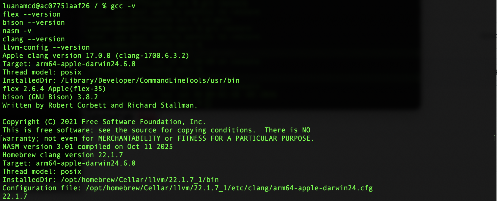
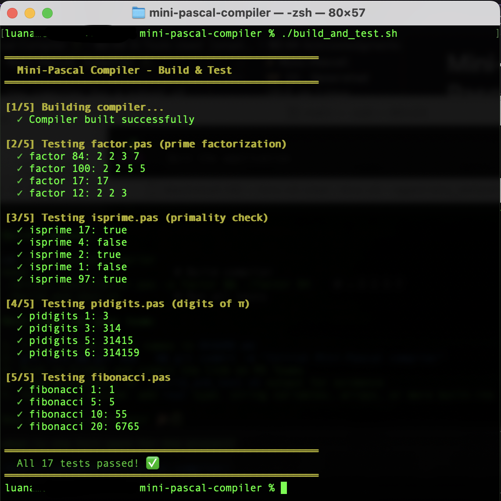

# Mini-Pascal Compiler 🐉

A toy compiler for a subset of Pascal, built with **Flex** (lexer), **Bison** (parser), and **LLVM** (code generation).

## Team Members

- Fernanda Gazda da Silva
- Lilian Fernandes Souza
- Luana Gabrielle Rodrigues Macedo

## AI Tools Used

- **Claude** — Code generation and project structure
- **ChatGPT** — Code review and documentation assistance

## Project Overview

This compiler takes Mini-Pascal source files (`.pas`) and produces native executables for macOS/Linux x86-64.

### Pipeline

```
source.pas → [Flex] → tokens → [Bison] → AST → [Sema] → AST → [LLVM CodeGen] → IR → [Clang] → executable
```

## Language Features

- **Types**: `integer`, `boolean`
- **Variables**: declaration with `var` block
- **Control**: `if-then-else`, `while-do`, `for-to/downto-do`
- **Functions/Procedures**: with parameters, local variables, and return values
- **I/O**: `write`, `writeln` (strings and integers)
- **CLI args**: `paramstr(n)` returns argv[n] as integer
- **Operators**: `+`, `-`, `*`, `div`, `mod`, `=`, `<>`, `<`, `>`, `<=`, `>=`, `and`, `or`, `not`
- **Early return**: `exit(value)` from inside a function
- **Comments**: `{ ... }`, `(* ... *)`, `// ...`
- **Structure**: `program Name; ... begin ... end.`

## Prerequisites

```bash
# macOS
brew install flex bison llvm

# Ubuntu/Debian
sudo apt install flex bison llvm-dev clang libllvm-dev
```

## Environment Check

```bash
gcc -v
flex --version
bison --version
clang --version
llvm-config --version
```

## Quick Start

```bash
# Build the compiler
make

# Compile a test program
./minipc tests/factor.pas -o factor
./factor 84
# Output: 2 2 3 7

# Inspect generated LLVM IR instead of linking
./minipc tests/factor.pas --emit-ir

# Run all tests
./build_and_test.sh
```

## Test Programs

| Program | Description | Example |
|---------|-------------|---------|
| `factor.pas` | Prime factorization | `./factor 84` → `2 2 3 7` |
| `isprime.pas` | Primality test | `./isprime 17` → `true` |
| `pidigits.pas` | Digits of π (max 6) | `./pidigits 5` → `31415` |
| `fibonacci.pas` | Fibonacci number | `./fibonacci 10` → `55` |

## Project Structure

```
mini-pascal-compiler/
├── README.md
├── TUTORIAL.md
├── Makefile
├── build_and_test.sh
├── src/
│   ├── lexer.l          # Flex lexical analyzer
│   ├── parser.y         # Bison grammar + semantic actions
│   ├── ast.h            # AST node definitions
│   ├── sema.h/.cpp      # Type checking + symbol table
│   ├── codegen.h        # LLVM code generation header
│   ├── codegen.cpp      # LLVM code generation implementation
│   └── main.cpp         # Driver program
├── tests/
│   ├── factor.pas
│   ├── isprime.pas
│   ├── pidigits.pas
│   └── fibonacci.pas
├── AI_USAGE.md          # AI tools used and prompts
└── docs/
    ├── env_check.png    # Toolchain version evidence
    ├── test_runs.png    # build_and_test.sh output
    └── artifacts/       # Lex/Bison output, LLVM IR, native assembly
        ├── lex.yy.cpp
        ├── parser.tab.cpp
        ├── parser.tab.h
        ├── *.ll         # LLVM IR for each test program
        └── *.s          # Native assembly for each test program
```

## Evidence

### Environment check



### Test programs running



## Compilation Pipeline

```
source.pas → Flex (lexer.l)
           → Bison (parser.y)
           → AST
           → Sema (sema.cpp)        # type checking, symbol table
           → CodeGen (codegen.cpp)  # LLVM C++ API
           → LLVM IR (.ll)
           → clang
           → native executable
```

Semantic errors (undeclared identifiers, type mismatches, arity errors) are
reported with line numbers before any IR is generated.

## Limitations

The language is intentionally minimal. The compiler does **not** support:

- `real`, `string`, `char`, or any composite types
- Arrays, records, pointers, sets, files
- `repeat-until` and `case` statements
- `var` (by-reference) parameters
- `break` / `continue` (use the `i := n` trick or `exit(value)` from a function)
- Nested function declarations
- Dynamic memory allocation
- Real-number arithmetic, overflow detection (32-bit `integer` only)

If you need any of these, the compiler will reject the program at parse or
semantic-analysis time rather than miscompile it.

## References

- 🐉 Dragon Book — Compilers: Principles, Techniques, and Tools
- [Flex Documentation](https://github.com/westes/flex)
- [Bison Manual](https://www.gnu.org/software/bison/manual/)
- [LLVM Documentation](https://llvm.org/docs/)
- [`AI_USAGE.md`](AI_USAGE.md) — AI tools and prompts used
